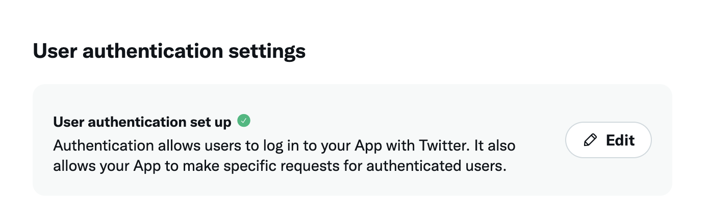
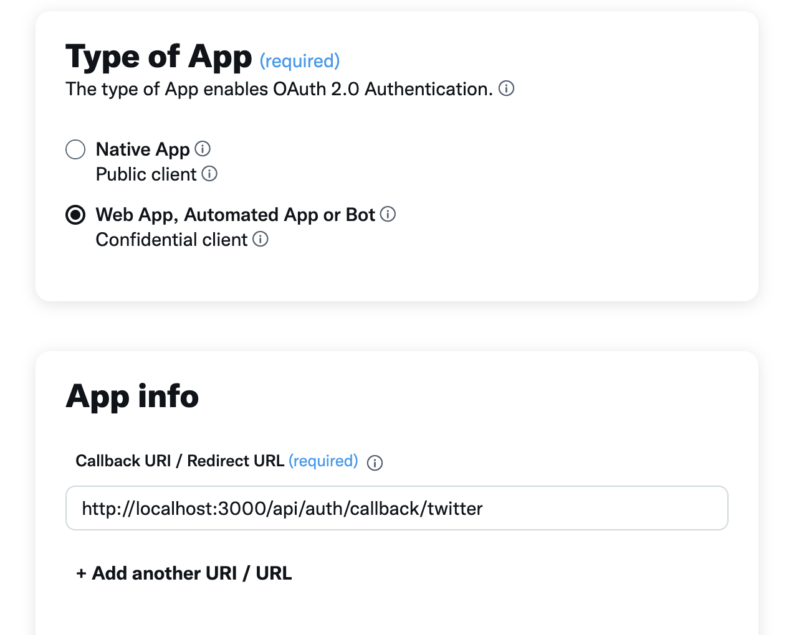
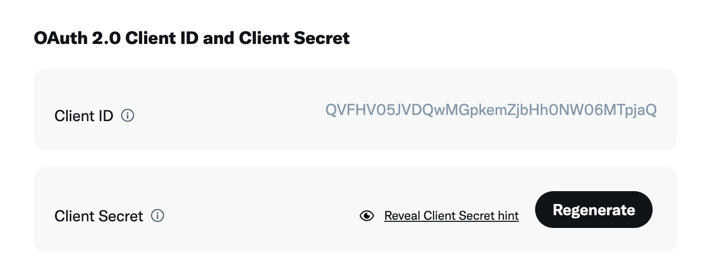

# Next JS (App Router) + X Integration
This repo demonstrates a simple way to integrate Next JS (App Router) with X. Here're the list of integrations:
1. Authentication with OAuth2
2. Personal profile fetching (username and image)
3. Create a post

## Dependencies
1. NextAuth - https://next-auth.js.org/providers/twitter
2. TwitterAPIV2 - https://www.npmjs.com/package/twitter-api-v2

## X developer portal setup
1. Login to X.
2. Head to https://developer.twitter.com/en/portal/dashboard. You can refer to this video for initial X developer account setup: https://www.youtube.com/watch?v=Ns9xH-5v3Po.
3. Create a project. On the project page, setup user authentication settings.<br/>

4. Set app permission to be `Read and write and Direct message`.<br/>

5. Select type of app. Add a correct callback URL.<br/>

6. On the project page, navigate to `Keys and tokens` tab. Get `Client ID` and `Secret`. Refer to the provided screenshot.<br/>

## Next JS project setup
1. Copy `.env.example` file to your project and rename to `.env.local`. Fill in your own `Client ID` and `Secret` retrived in the previous step.
2. Install dependencies `npm i -s next-auth passport-twitter`.
3. Create an API handler of next auth. Follow this folder structure: `app/api/auth/[...nextauth]/route.ts`.
4. Copy the content in `app/api/auth/[...nextauth]/route.ts` to your project.
5. Add `SessionProvider` on the root-level `template.tsx`. See the example on the `app/template.tsx` file.
6. Use `TwitterLogin` on your project. See the example of usage in the `app/page.tsx` and `components/TwitterLogin.tsx` files.

## Create tweets using API
1. We'll be using `twitter-api-v2` for interacting with X API. So, install it first `npm i -s twitter-api-v2`.
2. Grant the `tweet.write` scope to the app. See `/app/auth/[...nextauth]/route.ts`.
```ts
providers: [
    TwitterProvider({
      //...
      authorization: {
        //...
        params: {
          scope: "tweet.read tweet.write users.read offline.access", // Define your scopes here
        },
      },
    }),
    // ... other providers
  ],
```
3. Since the `twitter-api-v2` doesn't support frontend application, we'll need to use it in the backend. See an example implementation of a handler route in the `app/x/post/route.ts` file.
4. See how to create a post from frontend in the `components/TwitterPost.tsx` file.

## Handling missing types in a module
A type compilation problem will occur when we add this part to `app/api/auth/[...nextauth]/route.ts` file:
```ts
  callbacks: {
    async jwt({ token, account }) {
      if (account) {
        token.accessToken = account.access_token // Property 'accessToken' does not exist on type 'JWT'.
      }
      return token
    },
    async session({ session, token }) {
      session.accessToken = token.accessToken // Property 'accessToken' does not exist on type 'Session'.
      return session
    }
  }
```
To address the problem, we'll need to create type declaration. See examples in `types/next-auth.d.ts`.
In there, we do the following steps:
1. Import the module that we want to extend. In this case: `import 'next-auth'`;
2. Declare module to extend properties in some interfaces.
```ts
    declare module 'next-auth/jwt' { // 'next-auth/jwt' is used because JWT is imported in that path
        /** Extending the built-in JWT types to include custom properties */
        interface JWT {
            accessToken?: string; // Extend the 'accessToken' property in the JWT interface
        }
    }

```

## Notes
This repo is not a perfect example of how to integrate with X API. I found that the app disconnects from X after a post is created. This can happen because the X API OAuth V2 and NextAuth integration is still in beta verion. Otherwise, my implementation is not correct. If you find some way to resolve it and create a PR to this repo, it will be much appreciated :D.

## Author
Sainy, CTO at Finstable Co., Ltd.